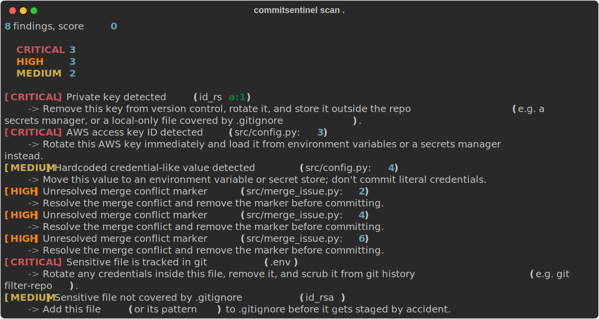

# CommitSentinel

A repo scanner that catches what shouldn't get committed: leaked secrets,
unresolved merge conflict markers, and sensitive files that are tracked,
staged, or one `git add .` away from being tracked.



## What it checks

- **Secrets** — AWS keys, GitHub tokens, OpenAI/Google API keys, JWTs,
  private SSH keys, Slack tokens, hardcoded `password=`/`secret=` values,
  and Shannon-entropy detection for high-entropy strings that don't match
  any known format.
- **Merge conflict markers** — unresolved `<<<<<<<` / `=======` /
  `>>>>>>>` left in committed code.
- **Sensitive files** — `.env`, `.pem`, `id_rsa`, `credentials.json`,
  `firebase-adminsdk*.json`, `.p12`, and similar, checked against git
  itself: already committed, staged, or just sitting ungitignored in the
  working tree.

Every finding gets a severity, a risk score contribution, and a concrete
recommendation. A clean repo reports `0 findings, score 100`.

## Install

```bash
git clone <this-repo-url>
cd commitsentinel
python -m venv venv

# macOS/Linux:
source venv/bin/activate
# Windows (PowerShell):
.\venv\Scripts\Activate.ps1

pip install -e .
```

(Not yet on PyPI — `pip install commitsentinel` will work once it's published.)

Using a virtual environment (above) means the `commitsentinel` command lands
somewhere already on your PATH — that's what makes `commitsentinel scan .`
below work right after install. If you skip the venv and install globally
instead, pip may put the command in a folder that isn't on PATH yet (common
on Windows). If `commitsentinel` isn't recognized after install, run it as
a module instead — this always works regardless of PATH:

```bash
python -m commitsentinel.cli scan .
```

## Usage

```bash
commitsentinel scan .
commitsentinel scan /path/to/some/other/repo
```

A clean repo looks like this:


### AI explanations (optional)

```bash
pip install -e ".[ai]"

# macOS/Linux:
export ANTHROPIC_API_KEY=sk-ant-...
# Windows (PowerShell):
$env:ANTHROPIC_API_KEY = "sk-ant-..."

commitsentinel scan . --explain
```

Adds a one-sentence, context-aware explanation to each finding, generated
in a single batched call after scanning finishes. Only structural fields
(title, severity, category, file, line) are sent to the model — never the
redacted secret previews in a finding's metadata. Works fine without this:
`--explain` is additive, not required.

## How scoring works

```
risk = (critical_count * 20) + (high_count * 10)
     + (medium_count * 5)  + (low_count * 2)

security_score = max(0, 100 - risk)
```

Deliberately simple for v0.1 — the curve can change once real scan data
shows whether it under- or over-penalizes.

## Architecture

Scanners never know about each other. Every scanner implements one method:

```python
class Scanner(ABC):
    def scan(self, repo_path: Path) -> list[Finding]: ...
```

and returns a flat list of `Finding` objects (see
`commitsentinel/models/finding.py`). `cli.py` just loops over a list of
scanner instances and concatenates the results — adding a new scanner
later is one new module plus one line registering it, nothing else
changes.

## Roadmap

Postponed past v0.1 on purpose: GitHub Action, git hooks, HTML/SARIF
reports, a dashboard, git-history scanning, repo-config auditing (branch
protection, Dependabot, signed commits), repo hygiene checks
(LICENSE/CODEOWNERS), SAST-style checks (SQLi, XSS, `eval()`/
`pickle.loads()`), and AI code review.

## Feedback

This is a v0.1 release — if something false-positives, misses an obvious
case, or you'd want a scanner this doesn't have yet, open an issue.
